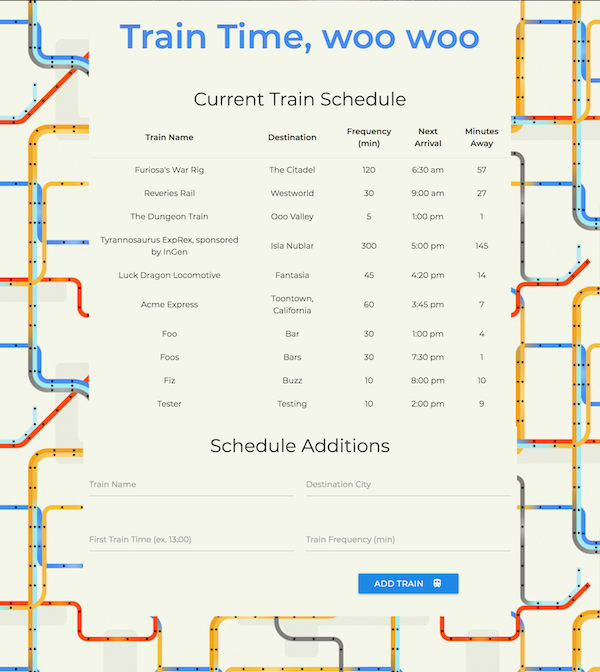

<h1 align="center">TrainTime</h1>

Train schedule application incorporating Firebase to host arrival and departure data

## Deployed Application

[GitHub Pages] <https://g33klaura.github.io/TrainTime/>

<!-- ## Concept -->

## Technologies Used

Firebase, JavaScript, jQuery, Moment.js, Materialize.css, HTML

## Key Features

* Incorporates Firebase to host arrival and departute data
* Retrieves and manipulates this information with Moment.js
* Provides up-to-date information about trains, arrival times, and how many minutes remaining until arrival
* New trains can be added via form on the page

### Screenshots

###### Main screen

*All aboard!* :station: